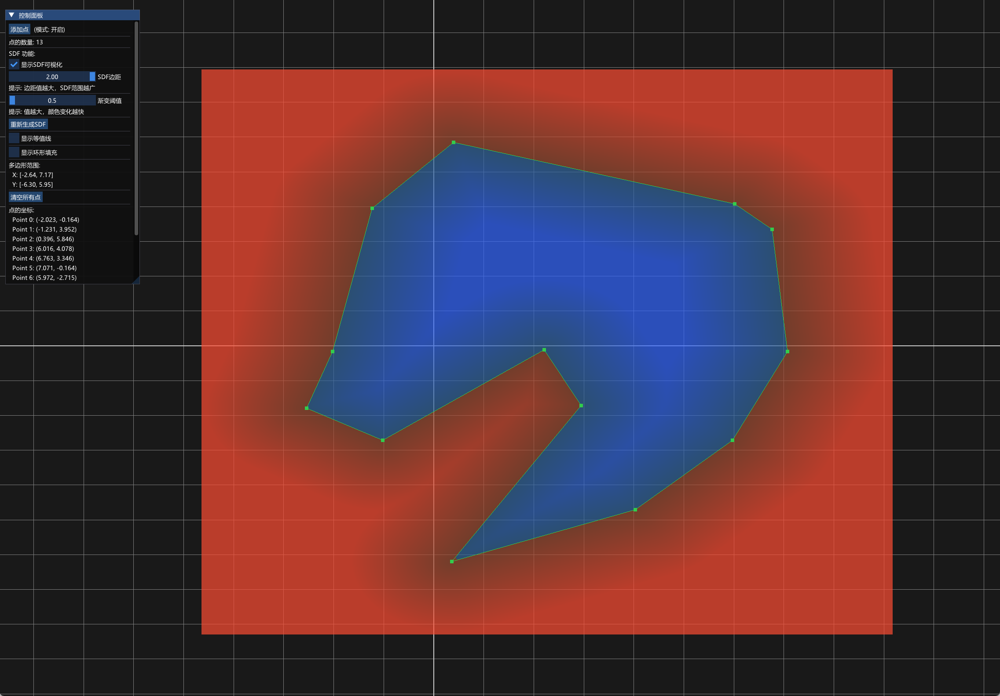
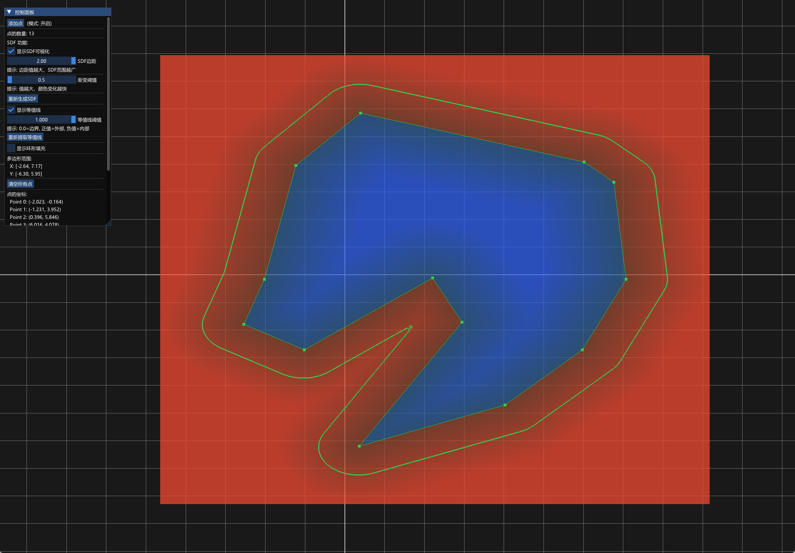
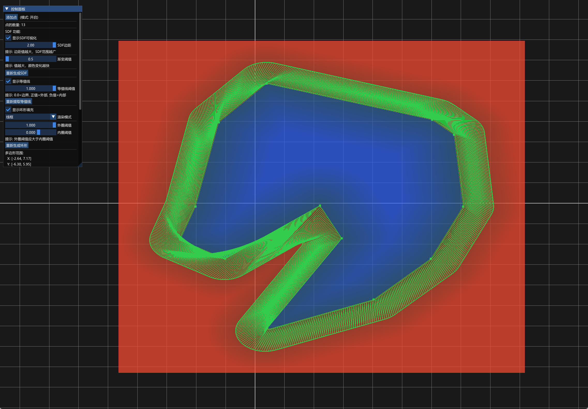

# GitHub 发布准备指南

## 📋 发布前检查清单

### ✅ 必要文件

- [x] `README.md` - 项目主页
- [x] `LICENSE` - MIT许可证
- [x] `.gitignore` - Git忽略配置
- [x] `CONTRIBUTING.md` - 贡献指南
- [x] `API_USAGE.md` - API文档
- [x] `API_README.md` - API快速入门
- [x] `example_usage.cpp` - 示例代码

### 📁 推荐的目录结构

```
SDF_2D/
├── docs/                      # 📄 文档和媒体资源
│   ├── demo.mp4              # 🎬 演示视频（放这里）
│   ├── screenshots/          # 📸 截图文件夹
│   │   ├── sdf_visualization.png
│   │   ├── iso_contour.png
│   │   └── ring_fill.png
│   └── algorithm/            # 📚 算法说明（可选）
│       └── marching_squares.md
│
├── main.cpp                  # 主程序
├── sdf.h                     # SDF算法接口
├── sdf.cpp                   # SDF算法实现
├── SDFProcessor.h            # 高层API接口
├── SDFProcessor.cpp          # 高层API实现
│
├── API_USAGE.md             # API详细文档
├── API_README.md            # API快速入门
├── example_usage.cpp        # 示例代码
│
├── CMakeLists.txt           # CMake配置
├── setup.bat                # 依赖安装脚本
├── build.bat                # 编译脚本
├── run.bat                  # 运行脚本
│
├── .gitignore              # Git忽略文件
├── LICENSE                 # 许可证
├── README.md               # 项目说明
└── CONTRIBUTING.md         # 贡献指南
```

## 🎬 演示视频处理

### 步骤1: 创建docs目录

```bash
# 在项目根目录
mkdir docs
mkdir docs\screenshots
```

### 步骤2: 移动demo.mp4

```bash
# 将demo.mp4移动到docs目录
move demo.mp4 docs\demo.mp4
```

### 步骤3: 截取关键帧（可选）

如果你想在README中显示截图，可以：

1. 使用视频播放器截取关键帧
2. 保存为PNG格式
3. 放入 `docs/screenshots/` 目录
4. 推荐截图：
   - `sdf_visualization.png` - SDF纹理渐变效果
   - `iso_contour.png` - 等值线提取效果
   - `ring_fill.png` - 环形填充效果

### 步骤4: 更新README中的链接

在README.md中引用：

```markdown
## 🎬 演示

[查看完整演示视频](docs/demo.mp4)

### 截图展示

<table>
  <tr>
    <td></td>
    <td></td>
    <td></td>
  </tr>
</table>
```

## 📝 替换README.md

### 使用新的GitHub版本

```bash
# 备份原README
copy README.md README_OLD.md

# 使用新版本
copy README_GITHUB.md README.md

# 删除临时文件（确认无误后）
del README_GITHUB.md
```

## ⚙️ Git初始化和提交

### 步骤1: 初始化Git仓库

```bash
# 如果还没有初始化
git init

# 添加远程仓库
git remote add origin https://github.com/your-username/SDF_2D.git
```

### 步骤2: 提交所有文件

```bash
# 添加所有文件
git add .

# 检查将要提交的文件
git status

# 提交
git commit -m "Initial commit: SDF 2D Geometry Processor"

# 推送到GitHub
git push -u origin main
```

## 🎨 GitHub仓库设置

### 1. About部分

在GitHub仓库页面右上角，点击设置图标：

- **Description**: A powerful 2D geometry processor based on Signed Distance Field
- **Website**: (如果有)
- **Topics**: 添加标签
  - `sdf`
  - `signed-distance-field`
  - `marching-squares`
  - `computational-geometry`
  - `opengl`
  - `cpp`
  - `2d-graphics`
  - `geometry-processing`

### 2. README徽章

在README中添加的徽章会自动显示：
- License徽章
- C++版本徽章
- OpenGL版本徽章
- Platform徽章

### 3. Releases

创建第一个Release：

1. 点击 "Releases" → "Create a new release"
2. Tag version: `v1.0.0`
3. Release title: `Initial Release - v1.0.0`
4. Description:
```markdown
## 🎉 首次发布

### ✨ 核心功能
- ✅ SDF生成和查询
- ✅ 等值线提取 (Marching Squares)
- ✅ 环形区域三角化 (Triangle Strip)
- ✅ 实时可视化 (OpenGL + ImGui)
- ✅ 简洁API (SDFProcessor)

### 📦 下载
- Windows可执行文件: SDF_Geo.exe
- 源代码: Source code (zip/tar.gz)

### 📖 文档
- [API文档](API_USAGE.md)
- [快速开始](README.md#-快速开始)
- [示例代码](example_usage.cpp)

### 🎬 演示
- [演示视频](docs/demo.mp4)
```

## 📸 截图建议

推荐截取这些场景：

1. **SDF可视化** (`sdf_visualization.png`)
   - 显示多边形
   - 显示SDF纹理（红蓝渐变）
   - 显示网格

2. **等值线提取** (`iso_contour.png`)
   - 显示原始多边形（黄色）
   - 显示等值线（绿色粗线）
   - 显示SDF纹理背景

3. **环形填充** (`ring_fill.png`)
   - 显示环形区域（实心）
   - 或显示线框模式看三角形

4. **UI界面** (`ui_panel.png`)
   - 显示完整的ImGui控制面板
   - 展示所有可调参数

## 🔄 更新README个人信息

在 `README.md` 中替换：

```markdown
# 需要替换的内容：

1. GitHub用户名
   - https://github.com/yourusername/SDF_2D
   → https://github.com/YOUR_ACTUAL_USERNAME/SDF_2D

2. 作者信息
   - **Your Name** - *Initial work*
   → **你的名字** - *Initial work*

3. 联系方式
   - 📧 Email: your.email@example.com
   → 📧 Email: your_real_email@example.com
   
   - 🐦 Twitter: [@yourhandle]
   → 🐦 Twitter: [@your_real_handle] (或删除)

4. LICENSE中的版权信息
   - Copyright (c) 2025 [Your Name]
   → Copyright (c) 2025 你的名字
```

## ✅ 发布前最终检查

- [ ] README.md中的所有链接都正确
- [ ] demo.mp4在docs目录中
- [ ] 截图（如果有）在docs/screenshots/中
- [ ] 所有个人信息已更新
- [ ] LICENSE中的名字已更新
- [ ] .gitignore正确配置（build/目录不会被提交）
- [ ] 代码能够成功编译
- [ ] 所有脚本（setup.bat, build.bat, run.bat）能正常工作
- [ ] API文档链接正确

## 🚀 发布！

完成以上步骤后：

```bash
# 最终检查
git status

# 提交并推送
git add .
git commit -m "docs: update documentation for GitHub release"
git push origin main
```

然后在GitHub上：
1. 检查README显示是否正常
2. 创建第一个Release
3. 分享你的项目！

---

**祝发布顺利！** 🎉

如果遇到问题，可以参考：
- [GitHub文档](https://docs.github.com/)
- [Markdown指南](https://guides.github.com/features/mastering-markdown/)
